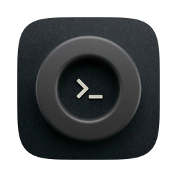
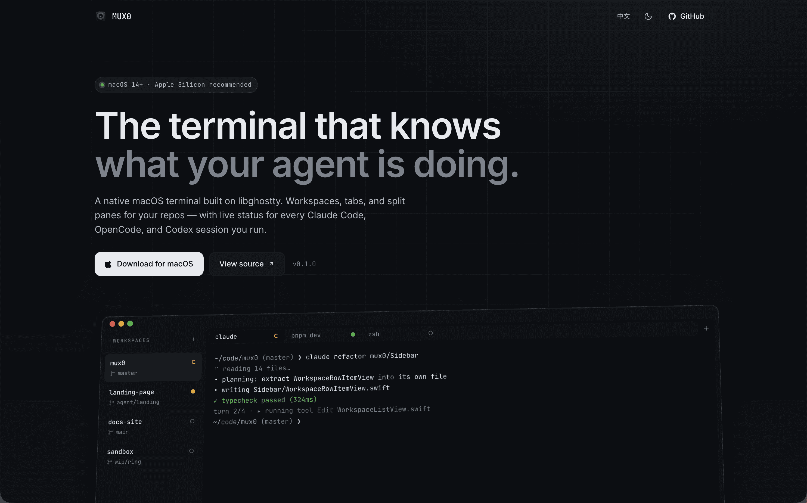

  <strong>English</strong> | <a href="README.zh-CN.md">简体中文</a>

  
  <h1>MUX0</h1>

A macOS tabbed-and-split terminal with live AI agent status in the sidebar. Organize terminals by project, split panes freely, and always know at a glance whether Claude Code, OpenCode, or Codex is running, idle, or waiting for you.

Powered by the [ghostty](https://ghostty.org) engine with Metal GPU rendering. Bilingual UI — English / 简体中文.

## Features

- **Workspaces → Tabs → Splits** — Organize terminals by project. Each workspace owns its own set of tabs; each tab is a split tree you can cut horizontally or vertically, drag dividers, and navigate with the keyboard.
- **Live AI Agent Status** — Sidebar and tab icons reflect `running` / `idle` / `waiting-for-input` / `finished` state for Claude Code, OpenCode, and Codex. Each turn is tagged success or failed. Hover an icon to see the currently running tool and (for Claude / Codex) a short summary of the agent's last reply.
- **Workspace Sidebar Metadata** — Every workspace row shows its current git branch, open PR status, and unread notifications — refreshed every 5 seconds in the background and updated live via OSC hooks from your shell.
- **Beautiful Theming** — Every ghostty theme bundled in. Adjust background opacity, window blur (vibrancy), cursor shape and blink, and unfocused-pane dimming. MUX0's own sidebar and tab bar re-tint to match the active terminal theme — no jarring chrome.
- **Bilingual UI** — Full English and Simplified Chinese. Switch in **Settings → Appearance → Language** without restarting.
- **Layout Persistence** — Workspace list, tab list, split layout, and each terminal's working directory survive across restarts.
- **Auto-Update** — In-app updates powered by Sparkle. A dot appears in the sidebar footer when a new version is ready; release notes are shown inline and you can defer or skip any release.

## System Requirements

- macOS 14.0 or later
- Apple Silicon strongly recommended (for Metal GPU rendering)

## Getting Started

### 1. Install

1. Download the latest `mux0.dmg` from [GitHub Releases](https://github.com/10xChengTu/mux0/releases).
2. Open the DMG and drag **MUX0** into your **Applications** folder.
3. Launch MUX0. On first launch macOS may show a security warning — go to **System Settings → Privacy & Security** and click **Open Anyway**.

After that, MUX0 checks for updates once a day automatically. You'll see a small dot in the sidebar footer when a new version is available.

### 2. Create Your First Workspace

1. Click the **＋** button in the sidebar.
2. Pick a project folder — this becomes the workspace's working directory.
3. The sidebar will immediately start tracking that folder's git branch, PR status, and notifications.

Tip: you can add as many workspaces as you like. Each one keeps its own tabs and split layout independently.

### 3. Open Tabs and Split Panes

- **New tab** — `⌘T`, or the **＋** button in the tab bar.
- **Close tab** — `⌘W`, or the ✕ button on the tab.
- **Split horizontally** — `⌘D`.
- **Split vertically** — `⌘⇧D`.
- **Move focus between panes** — `⌘⌥` + arrow keys.
- **Resize** — drag the divider with the mouse.
- **Rename tab / workspace** — double-click the title.
- **Reorder** — drag tabs or workspace rows.

### 4. Pick a Theme

Press `⌘,` to open **Settings**, then:

- **Appearance → Theme** — pick any ghostty theme. The sidebar and tab bar re-tint to match.
- **Appearance → Background Opacity** — drop below 1.0 for a translucent window.
- **Appearance → Background Blur** — combined with lower opacity, gives a frosted-glass effect.
- **Font → Font Family / Font Size** — pick any monospace font on your system.

See [`docs/settings-reference.md`](docs/settings-reference.md) for every setting.

### 5. Switch Language (Optional)

**Settings → Appearance → Language**: *System* (follow macOS language), *English*, or *简体中文*. The change applies instantly across the entire UI.

## Using AI Agents in MUX0

MUX0 automatically hooks into Claude Code, OpenCode, and Codex so their status shows live on the sidebar and tab icons. You don't need to configure anything — just run the agent as usual.

### Status Icons

| Icon color | Meaning |
|---|---|
| Green (pulsing) | Agent is running — a turn is in progress. |
| Amber | Agent is waiting for your input (permission request, clarifying question). |
| ✓ (green check) | Last turn finished cleanly. |
| ✕ (red cross) | Last turn had at least one tool error. |
| Gray | Idle / no agent running. |

Hover a status icon to see which tool is currently running (e.g. *"Edit Models/Foo.swift"*, *"Bash: ls"*) and, for Claude / Codex, a one-line summary of the agent's last reply.

### Supported Agents

| Agent | Command | Notes |
|---|---|---|
| **Claude Code** | `claude` | Full status + turn summary + tool detail. |
| **OpenCode** | `opencode` | Full status + tool detail. Summary not available yet. |
| **Codex** | `codex` | Status is experimental — may lag slightly behind. |

If an icon doesn't update, see [Troubleshooting](#troubleshooting) below.

## Troubleshooting

### Agent status icon isn't updating

- Make sure **Settings → Shell → Shell Integration** is enabled (default: *detect*).
- Close and re-open the terminal tab. The hooks activate when a new shell starts, so any shells that were already open before you last upgraded MUX0 won't be wired up.
- If you customized your shell's rc files (`~/.zshrc`, `~/.bashrc`, etc.) and disabled ghostty's shell integration, you'll need to re-enable it.

### Theme or font didn't change after saving

Settings debounce for ~200 ms before applying. If a change still hasn't appeared after a second or two, toggle the setting off and back on, or quit and relaunch MUX0.

### Window blur / transparency looks wrong

Blur only has visible effect when **Background Opacity** is below 1.0. If you want a frosted-glass look, lower the opacity first, then raise the blur radius.

### "MUX0 can't be opened" on first launch

This is macOS's Gatekeeper warning. Go to **System Settings → Privacy & Security**, scroll to the bottom, and click **Open Anyway** next to the MUX0 entry. You only need to do this once.

### Auto-update didn't pick up a new release

Auto-update runs at most once a day. To force a check, open **Settings → Update** and click **Check for Updates**.

## Documentation

- [Settings reference](docs/settings-reference.md) — every setting explained
- [Agent hooks reference](docs/agent-hooks.md) — how status icons are wired up
- [Internationalization](docs/i18n.md) — supported languages and behavior

## License

MUX0 is released under a **Source-Available License** — see [`LICENSE`](LICENSE). In plain English:

- **✅ Using MUX0 is free, including for commercial work.** Use it personally, use it at your company, use it to build and ship commercial products — just like you'd use any other terminal app. Anything you create inside MUX0 is yours.
- **✅ Forking to contribute back is welcome.** Fork on GitHub, make your changes, and open a PR. We appreciate contributions.
- **🚫 Redistributing MUX0 itself is not permitted.** No reselling, no bundling MUX0 into a product you ship, no hosting it as a service, no maintaining a competing fork as a parallel distribution. The source is published for transparency and contribution, not re-use as a product.

This is not an OSI-approved open-source license. For redistribution, bundling, hosting as a service, or maintaining a non-contribution fork, please contact the copyright holder.

**Contributions.** By submitting a pull request you agree to the terms in [LICENSE § 9](LICENSE) — in short, you grant the project permission to use and relicense your contribution as part of MUX0.
